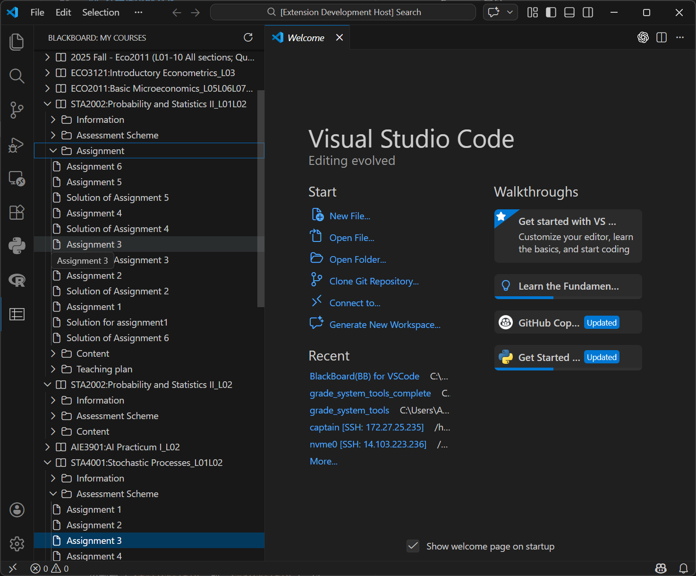

# BlackBoard(BB) VSCode Extension

[](https://marketplace.visualstudio.com/items?itemName=aCm1T.cuhksz-bb-explorer)
[](https://marketplace.visualstudio.com/items?itemName=aCm1T.cuhksz-bb-explorer)

An unofficial Visual Studio Code extension for viewing CUHK(SZ) BlackBoard courses natively. 

*[Read this document in Chinese (简体中文)](README_zh-CN.md)*



## Installation

You can install this extension directly from the [VS Code Marketplace](https://marketplace.visualstudio.com/items?itemName=aCm1T.cuhksz-bb-explorer).

**Method 1: Quick Open (Recommended)**
Press `Ctrl+P` / `Cmd+P` to launch VS Code Quick Open and paste the following command:
```bash
ext install aCm1T.cuhksz-bb-explorer
```

**Method 2: Extensions View**
1. Click the **Extensions** icon in the Activity Bar on the left side of VS Code.
2. Search for `BlackBoard Explorer` or `aCm1T`.
3. Click **Install**.

## Motivation & Purpose

As a student or developer, constantly switching between your code editor and a slow, bloated web browser to check course materials, assignments, or lecture slides is a massive drain on productivity. **BlackBoard Explorer** bridges this gap. 

The primary purpose of this extension is to **eliminate context switching**. By integrating your university's BlackBoard system directly into VSCode's Activity Bar, you can smoothly browse course structures, check resources, and open specific documents in your browser with a single click—all without leaving your coding environment.

## How It Works (Technical Principles)

BlackBoard utilizes complex Single-Sign-On (SSO) and CAS authentication mechanisms which often prevent automated headless logins or standard OAuth flows. 

To overcome this securely and natively, this extension relies on **Session Hijacking (Consensual)**:
1. **Authentication**: Instead of asking for your school username and password, the extension politely asks for your active `s_session_id` cookie from your browser. This cookie is securely stored in VSCode's local encrypted `SecretStorage`.
2. **API Interaction**: The extension makes standard REST calls to Blackboard's internal, public-facing APIs (e.g., `/learn/api/public/v1/users/me/courses` and `/learn/api/public/v1/courses/{courseId}/contents`).
3. **UI Integration**: JSON API Responses are parsed and mapped to VSCode's native `TreeDataProvider` API. This builds the dynamic, collapsible, folder-like structure you see in the sidebar. Click events (`vscode.commands`) are dynamically bound to leaf nodes to quickly delegate specific URLs to your default browser.

## Features

- **Course Navigation**: View a list of all your currently enrolled courses.
- **Content Browsing**: Expand courses to recursively explore folders, documents, and nested course materials dynamically.
- **Native Look & Feel**: Built perfectly into the VSCode UI using native `ThemeIcon` sets (folders, files, books).
- **One-Click Viewing**: Clicking on any document/file item natively delegates it to your default web browser where you are already logged in, allowing for instant viewing or downloading.
- **Secure Authentication**: Your cookie is secured in VSCode's vault. No passwords ever touch the extension.

---

## Detailed Usage Instructions

To use this extension, you need to provide your active Blackboard session cookie (`s_session_id`). 

### Step 1: Obtain Your Session Cookie
1. Open your web browser (Chrome, Edge, Firefox, etc.).
2. Navigate to [CUHK(SZ) BlackBoard](https://bb.cuhk.edu.cn) and log in with your credentials.
3. Once logged in, open the **Developer Tools** (Press `F12` or `Ctrl+Shift+I` / Mac: `Cmd+Option+I`).
4. Go to the **Application** tab (Chrome/Edge) or **Storage** tab (Firefox).
5. On the left sidebar, expand **Cookies** and select `https://bb.cuhk.edu.cn`.
6. Find the cookie named `s_session_id`.
7. Double-click its **Value** and copy it (it is a long alphanumeric string).

### Step 2: Login in VSCode
1. Open Visual Studio Code.
2. Press `F1` or `Ctrl+Shift+P` (`Cmd+Shift+P` on Mac) to open the Command Palette.
3. Type and select **`BB: Login`**.
4. An input box will appear. Paste the `s_session_id` cookie value you copied earlier and press Enter.
5. You should see a success notification: *"Blackboard session cookie saved successfully!"*

### Step 3: Browse & Interact
1. Click the **BlackBoard icon** in the far-left Activity Bar of VSCode.
2. Your courses will automatically load under the "My Courses" view.
3. **Expand** any course to view its folders. Expand those folders to dive deeper into nested subfolders.
4. **Click** on any file or document leaf node. It will instantly open the exact BlackBoard content page in your default browser for preview or download.
5. **Refresh**: If your courses sync out of date, simply click the **Refresh icon** at the top right of the view pane, or run **`BB: Refresh Courses`** from the Command Palette.

---

## Requirements

- Visual Studio Code version `1.85.0` or higher.
- An active CUHK(SZ) BlackBoard account and a valid session cookie.

## Contributing

If you want to modify or debug this extension locally, please refer to the [Development & Local Debugging Guide](CONTRIBUTING.md).

## License

This project is licensed under the [MIT License](LICENSE).

## Disclaimer

This is an **unofficial** extension and is not affiliated with, maintained, authorized, endorsed, or sponsored by Blackboard Inc. or CUHK(SZ). Please use it at your own risk.
